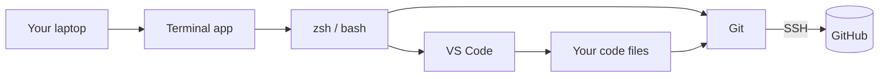
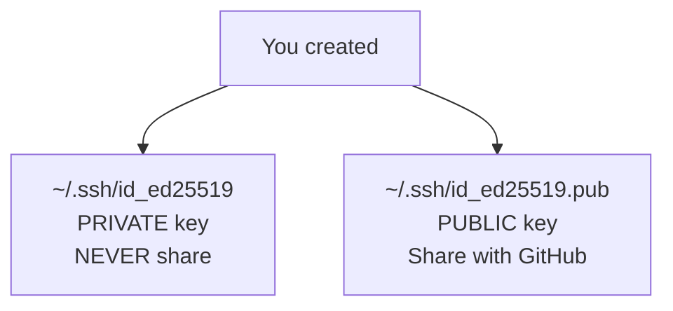
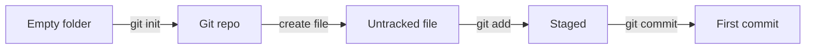

# Day 1 — Install everything

> [!IMPORTANT]
> **Why this matters.** You can't write software without an environment to write it in. Most learners don't quit because the math is hard — they quit because Day 1's install broke and nobody told them how to recover. Spend today doing this right. You'll never think about it again.
>
> 🇹🇭 *เพื่อนเรียนเขียนโปรแกรมส่วนใหญ่ไม่ได้เลิกเพราะคณิตศาสตร์ยาก แต่เลิกเพราะติดตั้งเครื่องมือวันแรกไม่สำเร็จและไม่มีใครช่วย วันนี้ตั้งใจทำให้ถูกต้องครั้งเดียว แล้วจะไม่ต้องคิดเรื่องนี้อีกตลอด 9 เดือนข้างหน้า*

## What you'll do today

**Time:** 2–3 hours.

By the end you'll have:

- [ ] A working terminal you like the look of
- [ ] VS Code installed, but no AI extensions yet
- [ ] Git configured with your real name and email
- [ ] An SSH key registered with GitHub
- [ ] One successful `ssh -T git@github.com` greeting from GitHub
- [ ] Your first commit on your first repo

## The map

This is what you're building today, end to end:



The terminal is the **only** way to control a computer that scales. Every server in the world is operated from one. By the end of Phase 5 you'll be ssh-ing into a real server in Germany — same terminal, same skills.

## 1. Pick a terminal

A terminal is a window that runs a shell. The shell is the program that interprets commands.

> [!NOTE]
> **In the wild:** Every software engineer at every serious company uses a terminal multiple hours a day. The default Terminal app on macOS works, but you'll be in this thing for thousands of hours — get one you enjoy.

**macOS:** install [iTerm2](https://iterm2.com/) or [Warp](https://www.warp.dev/). I recommend **Warp** for beginners — it has command suggestions and history search built in.

**Windows:** install [Windows Terminal](https://aka.ms/terminal) from the Microsoft Store. Then install [WSL2 with Ubuntu](https://learn.microsoft.com/en-us/windows/wsl/install). **You will do every command in this course inside WSL.** Native Windows command prompt doesn't have the tools we need.

**Linux:** you already have one.

**Try it now:**

```bash
$ echo "hello, world"
hello, world
```

That's a shell command. `echo` prints whatever you give it. `hello, world` is the output.

## 2. Install VS Code

Download from [code.visualstudio.com](https://code.visualstudio.com/). Install. Open it. Then immediately close it. We're not using it today.

Install **only these two extensions** — nothing else:

| Extension | Why |
|-----------|-----|
| GitLens | See who changed what, when, why — right in the editor |
| Markdown All in One | Better preview for your learning log |

> [!WARNING]
> **Do not install Copilot, Cursor, Claude, Codeium, or any AI extension.** Not yet. See [the AI policy](../../resources/ai-policy.md). Using AI in the first 6 phases means you'll never learn to code — you'll learn to prompt. That's a much weaker skill.

## 3. Install Git

Git is the time machine for your code. It tracks every change you make so you can undo, branch, and collaborate.

**macOS:**
```bash
$ xcode-select --install
```

A dialog will pop up. Click Install. Wait 5–10 minutes.

**Ubuntu / WSL:**
```bash
$ sudo apt update && sudo apt install git
```

**Check it worked:**
```bash
$ git --version
git version 2.43.0
```

(Yours might be a different version — anything 2.x is fine.)

## 4. Configure Git

These are global settings — your identity. Use **your real name** and an email you actually check.

```bash
$ git config --global user.name "Your Real Name"
$ git config --global user.email "you@example.com"
$ git config --global init.defaultBranch main
$ git config --global pull.rebase true
$ git config --global core.editor "code --wait"
```

What each line does:

| Line | What it does |
|------|--------------|
| `user.name` | Shows up on every commit you make. Forever. |
| `user.email` | Same. GitHub matches commits to accounts by email. |
| `init.defaultBranch main` | New repos start with a branch called `main`, not `master`. |
| `pull.rebase true` | When you pull, replay your commits on top of remote changes instead of making a merge commit. Cleaner history. |
| `core.editor "code --wait"` | When git needs you to write something (like a commit message), open VS Code. |

**Verify:**
```bash
$ git config --global --list
user.name=Your Real Name
user.email=you@example.com
init.defaultbranch=main
pull.rebase=true
core.editor=code --wait
```

## 5. Generate an SSH key

SSH is how your computer proves it's you when talking to GitHub. Instead of typing a password every time, you give GitHub a public key. Your computer keeps the private key. When you push, the two are matched.

> [!NOTE]
> **In the wild:** The Linux kernel — the operating system that runs most of the internet — accepts code contributions over SSH from thousands of developers. The exact key you're about to generate is the same kind they use.

```bash
$ ssh-keygen -t ed25519 -C "you@example.com"
```

It'll ask you:
1. Where to save it — press Enter for default.
2. A passphrase — **set one you'll remember.** Yes, it's annoying. The passphrase is the difference between "I lost my laptop" and "I lost my laptop AND my entire GitHub account."

```
Generating public/private ed25519 key pair.
Enter file in which to save the key (/Users/you/.ssh/id_ed25519): [press Enter]
Enter passphrase (empty for no passphrase): [type something memorable]
Enter same passphrase again:
Your identification has been saved in /Users/you/.ssh/id_ed25519
Your public key has been saved in /Users/you/.ssh/id_ed25519.pub
```

You now have two files:



## 6. Create a GitHub account

Go to [github.com/signup](https://github.com/signup).

**Pick your username carefully.** It'll be in URLs like `github.com/yourname` for years. Recruiters Google it. Pick something you'd put on a résumé. Avoid: gamer tags, your full birth date, anything you'd cringe at in 5 years.

## 7. Register your SSH key with GitHub

Copy the **public** key:

**macOS:**
```bash
$ pbcopy < ~/.ssh/id_ed25519.pub
```

**Linux / WSL:**
```bash
$ cat ~/.ssh/id_ed25519.pub
```

Then triple-click the output line to select, copy with Ctrl+C / Cmd+C.

Now in your browser:
1. Go to [github.com/settings/keys](https://github.com/settings/keys).
2. Click **"New SSH key"**.
3. Title: `My laptop` (or something you'd recognize in 6 months).
4. Key type: **Authentication Key**.
5. Paste your key into the Key box.
6. Click **"Add SSH key"**.

## 8. Test the connection

This is the moment everything either works or doesn't.

```bash
$ ssh -T git@github.com
The authenticity of host 'github.com (140.82.112.3)' can't be established.
ED25519 key fingerprint is SHA256:+DiY3wvvV6TuJJhbpZisF/zLDA0zPMSvHdkr4UvCOqU.
Are you sure you want to continue connecting (yes/no/[fingerprint])? yes

Hi yourusername! You've successfully authenticated, but GitHub does not provide shell access.
```

That last line — "Hi yourusername!" — is what you're looking for. It means your SSH key works.

If you see "Permission denied (publickey)" instead, your key isn't registered correctly. Go back to step 7.

## Mini-exercise — your first commit

Now you'll create a tiny repo, make a commit, and push it. The same loop you'll do thousands of times this course.

```bash
$ cd ~                                  # go home
$ mkdir prince                          # make a folder for the course
$ cd prince                             # enter it
$ mkdir scratch                         # make a sub-folder for throwaway stuff
$ cd scratch
$ mkdir hello && cd hello
$ git init                              # turn this folder into a git repo
Initialized empty Git repository in /Users/you/prince/scratch/hello/.git/

$ echo "I made my first commit on $(date)" > README.md
$ cat README.md
I made my first commit on Mon May 19 21:12:33 +07 2026

$ git status
On branch main
No commits yet
Untracked files:
  (use "git add <file>..." to include in what will be committed)
	README.md

$ git add README.md
$ git commit -m "Initial commit"
[main (root-commit) a3f5d12] Initial commit
 1 file changed, 1 insertion(+)
 create mode 100644 README.md

$ git log
commit a3f5d12... (HEAD -> main)
Author: Your Real Name <you@example.com>
Date:   Mon May 19 21:13:01 2026 +0700

    Initial commit
```

You just did this:



**You have a real Git repo with a real commit.** That's it. That's the whole loop. You'll do this 10,000 more times in your career. The first time is today.

## Connect to the project

> [!TIP]
> **Connects to the project:** Tomorrow you'll learn the terminal in depth. Day 3 you'll dive into git for real. By Day 4 you'll push your `learning-log` repo to GitHub — your **first public artifact**, the one that'll grow into a wall of green for the next 35 weeks. The commit you just made today doesn't go anywhere, but the muscle memory does.

## Self-check

Try answering each in your head first. Then click to expand.

<details>
<summary>1. What's the difference between <code>~/.ssh/id_ed25519</code> and <code>~/.ssh/id_ed25519.pub</code>?</summary>

The first is your **private** key — never share, never email, never paste online. The second is your **public** key — safe to share, you put it in GitHub, AWS, any service that supports SSH.
</details>

<details>
<summary>2. Why did we set <code>init.defaultBranch</code> to <code>main</code>?</summary>

GitHub (and most modern projects) default new repos to a branch called `main` instead of the older `master`. Setting this locally means your `git init` matches that convention automatically.
</details>

<details>
<summary>3. What does <code>git status</code> show in a fresh empty repo?</summary>

"On branch main / No commits yet" plus a list of untracked files if any exist. It's saying "I see the repo, but nothing has been committed yet."
</details>

<details>
<summary>4. What did <code>git add</code> do that <code>git commit</code> didn't?</summary>

`git add` puts the file into the **staging area** — "I want this in the next commit." `git commit` snapshots whatever's staged and writes it to history with a message. Add says *what*; commit says *now*.
</details>

<details>
<summary>5. If the SSH test prints "Hi yourusername!" — what does that confirm?</summary>

That your SSH private key, the matching public key on GitHub, and your GitHub account are all linked correctly. From now on, GitHub will recognize this machine as yours.
</details>

## What's next

Tomorrow: the terminal itself. The window you opened today, but actually *use* it.
