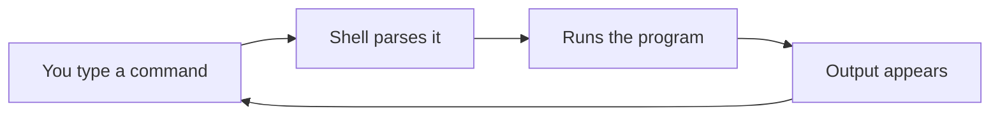
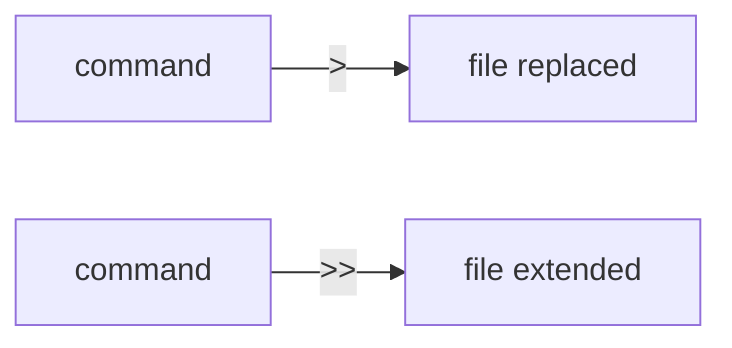

# Day 2 — The terminal

> [!IMPORTANT]
> **Why this matters.** Pixar movies are rendered with terminal commands. Netflix deploys with them. Every server, every database, every CI pipeline — terminal first. Programmers who fight the terminal stay junior. Programmers who love it move 10× faster than the rest. Today you start loving it.
>
> 🇹🇭 *หนัง Pixar เรนเดอร์ด้วย terminal · Netflix deploy ด้วย terminal · ทุกเซิร์ฟเวอร์ ทุกฐานข้อมูล ทุก CI pipeline เริ่มที่ terminal · โปรแกรมเมอร์ที่ฝืน terminal จะเก่งช้า · คนที่รัก terminal จะทำงานเร็วกว่าคนอื่น 10 เท่า · วันนี้เริ่มรักมันได้แล้ว*

## What you'll do today

**Time:** 3 hours.

By the end you can, without thinking:

- [ ] Navigate any directory tree
- [ ] Create, copy, move, and delete files
- [ ] Chain commands with pipes
- [ ] Redirect output to files
- [ ] Use Tab completion as your superpower
- [ ] Find and re-run any command from your history

## The mental model

The terminal is a conversation.



That's the whole loop. Type something. Press Enter. See result. Type next thing.

The trick is: each command does **one** small thing. Power comes from **combining** them. `grep` finds. `sort` sorts. `wc` counts. Pipe them together and you've replaced what would be a 200-line Python script.

> [!NOTE]
> **In the wild:** The most senior engineers you'll ever meet don't type the most code — they type the smallest commands that get the job done. A staff engineer fixing a production incident isn't writing a script; they're piping `journalctl` into `grep` into `less`. That fluency is what we're building today.

## 1. Where am I?

Every terminal session has a "current directory." Three commands tell you about it.

```bash
$ pwd
/Users/you/prince
```

`pwd` = "print working directory." This is where you are right now.

```bash
$ ls
README.md  notes  scratch  syllabus.md
```

`ls` = list. Shows what's in the current directory.

```bash
$ ls -la
total 24
drwxr-xr-x  4 you  staff   128 May 19 21:00 .
drwxr-xr-x  3 you  staff    96 May 19 20:55 ..
drwxr-xr-x  3 you  staff    96 May 19 21:00 .git
-rw-r--r--  1 you  staff  4096 May 19 21:00 README.md
drwxr-xr-x  2 you  staff    64 May 19 21:00 notes
drwxr-xr-x  2 you  staff    64 May 19 21:00 scratch
-rw-r--r--  1 you  staff  3877 May 19 21:00 syllabus.md
```

The `-l` flag = long format (permissions, owner, size, date). The `-a` flag = show hidden files (starting with `.`). Flags can be combined: `-la`.

**What just happened:** the `.git/` folder shows up now. It was hidden before because it starts with `.`. Hidden doesn't mean important-secret; it means "shell clutter, not usually your business."

## 2. Moving around

```bash
$ cd ~              # home directory
$ pwd
/Users/you

$ cd Desktop        # relative — go into Desktop from here
$ pwd
/Users/you/Desktop

$ cd ..             # up one level
$ pwd
/Users/you

$ cd /etc           # absolute — straight to /etc no matter where I was
$ pwd
/etc

$ cd -              # back to where I was BEFORE
$ pwd
/Users/you
```

> [!TIP]
> `cd -` is one of the most underused commands in computing. When you need to bounce between two folders all day, `cd -` is your friend.

### Try it

Type these in order. Predict the output before each. Then run.

```bash
$ pwd
$ cd ~
$ pwd
$ cd /
$ pwd
$ ls
$ cd -
$ pwd
```

The `/` directory is the **root** of your entire filesystem. Everything else lives inside it.

## 3. Make stuff, see stuff

```bash
$ cd ~/prince/scratch    # if this doesn't exist, mkdir -p ~/prince/scratch
$ mkdir terminal-day
$ cd terminal-day

$ touch hello.txt
$ ls
hello.txt

$ echo "this is line 1" > hello.txt
$ cat hello.txt
this is line 1

$ echo "this is line 2" >> hello.txt
$ cat hello.txt
this is line 1
this is line 2
```

**What just happened:**

| Symbol | Meaning |
|--------|---------|
| `>` | Send output to this file, **overwriting** what was there |
| `>>` | Send output to this file, **appending** to the end |
| `cat` | "Concatenate" — print the file's contents to the terminal |

Get this distinction wrong and you erase a day's work. Get it right and you never think about it again.



## 4. The pipe — the killer feature

A pipe `|` sends the output of one command as the input to the next.

```bash
$ ls /usr/bin | head -5
2to3-2.7
2to3-3.11
[
a2p
acpitool

$ ls /usr/bin | wc -l
1043
```

`head -5` shows the first 5 lines. `wc -l` counts lines. Both got their input from `ls`.

You just answered "how many programs are in /usr/bin?" without writing a script.

### A useful real example

```bash
$ ls /usr/bin | grep -i python
python3
python3-config
python3.11
python3.11-config
```

`grep` searches. `-i` means case-insensitive. So you piped `ls` into `grep` to find every program with "python" in its name.

This is the pattern. **Each tool one job. Pipe to combine.** Engineers use this every single day.

## 5. Tab completion — non-negotiable

The Tab key is your single biggest productivity tool. Tab completes filenames, command names, paths. Half-type a thing, press Tab, the shell fills in the rest.

Try it:

```bash
$ cd ~/Des[press Tab]
$ cd ~/Desktop
```

If multiple matches, press Tab **twice**:

```bash
$ ls /usr/bi[Tab Tab]
bin/      bin64/    binutils/
```

Use Tab constantly. Typing full paths is a beginner habit.

## 6. Command history — your time machine

| Shortcut | What it does |
|----------|--------------|
| `↑` / `↓` | Walk through previous commands |
| `Ctrl-R` | **Search** history. Type a fragment; press Ctrl-R again to find earlier matches. |
| `!!` | Re-run the last command. |
| `!ls` | Re-run the last `ls` command (or any prefix). |

### Try it

```bash
$ echo "first"
first
$ echo "second"
second
$ !!
echo "second"
second
$ !echo
echo "second"
second
```

Press `Ctrl-R`. Type `echo`. Hit Enter. It re-runs the most recent matching command.

## 7. Stop a stuck command

You'll start something that hangs or runs too long. Press **Ctrl-C** to kill it.

```bash
$ sleep 30          # waits 30 seconds (boring)
^C                  # Ctrl-C kills it
$
```

`^C` is how the terminal shows you what you pressed. Ctrl-C sends a "kill yourself" signal to the running program. Almost every program respects it.

> [!WARNING]
> **Ctrl-C vs Ctrl-Z.** Ctrl-C kills. Ctrl-Z **suspends** (pauses) — and you have to `fg` to resume or `kill %1` to actually kill. If you accidentally hit Ctrl-Z and your terminal seems stuck, type `fg` and press Enter.

## Mini-project — investigate your machine

Use only what you've learned. Answer these in your terminal. Write the commands and their answers into `~/prince/scratch/terminal-day/investigation.md`.

1. **How many files are in your home directory** (visible and hidden combined)?
2. **What's the largest file** in `/usr/bin`? (Hint: `ls -lS /usr/bin | head -3` — `-S` sorts by size.)
3. **List every file in `/etc` whose name contains the word "host"** — write the command, paste the output.
4. **Save the output of `date`** into a new file `when.txt`. Print it back.

Commit this when you're done:

```bash
$ cd ~/prince/scratch/terminal-day
$ git init
$ git add investigation.md
$ git commit -m "Day 2 terminal investigation"
```

(You'll push this to GitHub on Day 4. For now, just local.)

## Connect to the project

> [!TIP]
> **Connects to the project:** Every Phase 5 lesson will be `ssh` into a server, then `ls`, `cd`, `cat`, `tail -f`, `grep` — exactly these commands, on a real machine in Germany serving real users. The terminal you're learning today is the **only** way to operate that server.
>
> Your learning log (the Phase 0 project) lives in a folder. You'll `cd` into it, `vim` or `code` it, `git add` it, `git commit` it. Every. Single. Day. For 35 weeks. Today's lesson is the keyboard for the rest of the course.

## Self-check

<details>
<summary>1. What does <code>cd -</code> do?</summary>

Goes to the previous directory you were in. Like the back button.
</details>

<details>
<summary>2. What's the difference between <code>></code> and <code>>></code>?</summary>

`>` overwrites the file (destroys old contents). `>>` appends to the end (keeps old contents). Mix them up and you erase work.
</details>

<details>
<summary>3. What does this command do? <code>ls /usr/bin | grep -i python | wc -l</code></summary>

Lists `/usr/bin`, filters to lines containing "python" (case-insensitive), counts the lines. Answers: "how many python-related programs are installed?"
</details>

<details>
<summary>4. Your terminal looks frozen. The cursor blinks but typing does nothing. What happened, what do you press?</summary>

You probably pressed Ctrl-S (which pauses output). Press Ctrl-Q to resume. Or if a long command is running, Ctrl-C to kill it.
</details>

<details>
<summary>5. You ran some long command 20 commands ago. What's the fastest way to run it again?</summary>

Press Ctrl-R, type a fragment of the command, press Enter when the right match appears.
</details>

## What's next

Tomorrow: git. Not "git for beginners" — actually understanding what git does, so you can fix it when it breaks.
