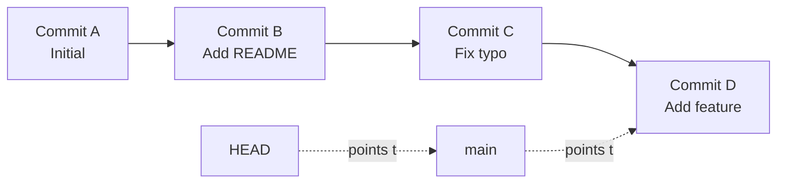
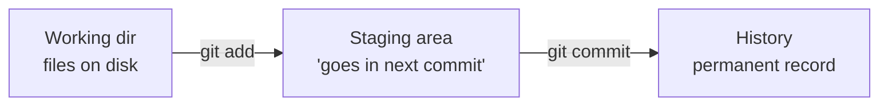
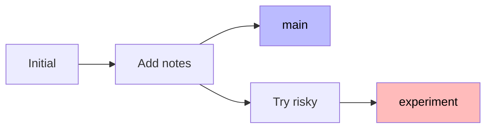

# Day 3 — Git fundamentals

> [!IMPORTANT]
> **Why this matters.** Git is the most important tool in your entire career. Linux uses it. Google uses it. Every job interview you'll have for the next 30 years will assume you know it. Most people use it for years without understanding what it does — they live in fear of it. Today you'll understand it. After today, git stops being scary.
>
> 🇹🇭 *Git คือเครื่องมือสำคัญที่สุดในอาชีพโปรแกรมเมอร์ — Linux ใช้ Google ใช้ และอีก 30 ปีข้างหน้าทุกบริษัทที่จะสัมภาษณ์เธอจะคาดว่าเธอใช้เป็น คนส่วนใหญ่ใช้ git อยู่หลายปีโดยไม่เข้าใจ — เขาเลยกลัวมัน วันนี้เธอจะเข้าใจ และหลังจากวันนี้ git จะไม่น่ากลัวอีกต่อไป*

## What you'll do today

**Time:** 3 hours.

By the end you can, from a blank prompt:

- [ ] Explain what a commit is, in 30 seconds, to a 12-year-old
- [ ] Create a branch, make changes, switch back — and understand why files disappeared
- [ ] Merge branches and resolve a small conflict
- [ ] Undo: an uncommitted change, a staged change, a bad commit message
- [ ] Read someone else's `git log` and understand the project's history

## The mental model — read this twice

Git tracks **snapshots** of your project. Every commit is a complete photo of every file. Branches are **labels** that point to specific commits. `HEAD` is the label that points to "where you currently are."

That's it. That's the whole thing.



When you make a new commit, the `main` branch label **moves forward** to the new commit. `HEAD` (which was pointing to `main`) follows along.

### The three places a file can live



| Place | What it is |
|-------|------------|
| **Working directory** | The actual files on disk. What you see in your editor. |
| **Staging area** | Files marked "include in the next commit." Like a shopping cart. |
| **Commit history** | Snapshots. Permanent. Have hashes. Can be branched, merged, undone. |

`git status` shows you the state of all three. It's the single most useful git command.

> [!NOTE]
> **In the wild:** The Linux kernel has over 1 million commits. Every Tuesday, Linus Torvalds reviews patches sent by hundreds of contributors — all using git. The same `git log`, `git diff`, `git commit` you're about to use is what runs the operating system on most of the planet's servers.

## 1. Make your first repo

```bash
$ cd ~/prince/scratch
$ mkdir git-day && cd git-day
$ git init
Initialized empty Git repository in /Users/you/prince/scratch/git-day/.git/

$ ls -la
total 0
drwxr-xr-x   3 you  staff   96 May 20 09:00 .
drwxr-xr-x   8 you  staff  256 May 20 08:55 ..
drwxr-xr-x  10 you  staff  320 May 20 09:00 .git
```

That `.git/` folder **is the repo**. Don't touch it directly. Git uses it to store everything: every commit, every branch, every config.

```bash
$ git status
On branch main

No commits yet

nothing to commit (create/copy files and use "git add" to track)
```

Now create a file:

```bash
$ echo "# My git playground" > README.md
$ git status
On branch main

No commits yet

Untracked files:
  (use "git add <file>..." to include in what will be committed)
	README.md

nothing added to commit but untracked files present (use "git add" to track)
```

`README.md` is **untracked**. Git sees the file but won't include it unless you say so.

```bash
$ git add README.md
$ git status
On branch main

No commits yet

Changes to be committed:
  (use "git rm --cached <file>..." to unstage)
	new file:   README.md
```

Now it's **staged**. About to be committed.

```bash
$ git commit -m "Initial commit"
[main (root-commit) 7b3f8a1] Initial commit
 1 file changed, 1 insertion(+)
 create mode 100644 README.md

$ git log
commit 7b3f8a1f2e9d... (HEAD -> main)
Author: Your Name <you@example.com>
Date:   Wed May 20 09:05:23 2026 +0700

    Initial commit
```

You have a one-commit history.

## 2. The everyday loop

This is what you'll do thousands of times.

```bash
# Step 1: Make a change
$ echo "Some notes." >> README.md

# Step 2: See what changed
$ git status
On branch main
Changes not staged for commit:
  (use "git add <file>..." to update what will be committed)
  (use "git restore <file>..." to discard changes in working directory)
	modified:   README.md

$ git diff
diff --git a/README.md b/README.md
index 1c4a0c1..d5e8a3b 100644
--- a/README.md
+++ b/README.md
@@ -1 +1,2 @@
 # My git playground
+Some notes.

# Step 3: Stage and commit
$ git add README.md
$ git commit -m "Add a notes line"
[main 9c2e1f4] Add a notes line
 1 file changed, 1 insertion(+)
```

**`git diff` is the second-most-useful command after `git status`.** It shows exactly what you changed. The `-` lines are removed; `+` lines are added.

### Try it

Make 3 more commits — each one adds or changes a line. Run `git log --oneline` after.

```bash
$ git log --oneline
9c2e1f4 (HEAD -> main) Add a notes line
7b3f8a1 Initial commit
```

`--oneline` is the cleanest log view. The hash on the left is the commit's unique fingerprint. The first 7 chars are enough to refer to it.

## 3. Branches

A branch is a movable label. When you commit on a branch, that label moves forward. The branch you started on (usually `main`) doesn't move unless you commit on it.

```bash
$ git switch -c experiment
Switched to a new branch 'experiment'
```

`-c` = create. You just made `experiment` and switched to it.

```bash
$ echo "I'm trying something risky." > risky.txt
$ git add risky.txt
$ git commit -m "Try something risky"
[experiment 4d8e3a2] Try something risky
 1 file changed, 1 insertion(+)
 create mode 100644 risky.txt

$ ls
README.md  risky.txt

$ git switch main
Switched to branch 'main'

$ ls
README.md
```

**The file `risky.txt` literally disappeared.** Don't panic. It's not gone — it's just only in the `experiment` branch. Switch back to see it:

```bash
$ git switch experiment
$ ls
README.md  risky.txt
```

This is the killer feature. **Branches let you try things without contaminating the working version.**



When you commit on `experiment`, only `experiment` moves. `main` stays where it was. Both branches share the history up to the branch point.

## 4. Merging

If the experiment was good, merge it into main.

```bash
$ git switch main
$ git merge experiment
Updating 9c2e1f4..4d8e3a2
Fast-forward
 risky.txt | 1 +
 1 file changed, 1 insertion(+)
 create mode 100644 risky.txt

$ ls
README.md  risky.txt

$ git log --oneline --all --graph
*   4d8e3a2 (HEAD -> main, experiment) Try something risky
*   9c2e1f4 Add a notes line
*   7b3f8a1 Initial commit
```

The `--graph` flag draws an ASCII diagram of how commits connect.

## 5. Common mistakes — and how to undo

This is the section everyone needs. Bookmark it.

### "I want to throw away changes I haven't committed"

```bash
$ echo "junk I don't want" >> README.md
$ git status
modified:   README.md

$ git restore README.md     # working dir back to last commit
$ git status
nothing to commit, working tree clean
```

> [!WARNING]
> `git restore` is **destructive**. Your unsaved changes are gone. Permanent. Be sure.

### "I added a file I didn't mean to"

```bash
$ git add accidental.txt
$ git status
new file:   accidental.txt

$ git restore --staged accidental.txt    # unstages, keeps file
$ git status
Untracked files:
	accidental.txt
```

### "My last commit message was bad"

```bash
$ git commit -m "stuff"            # noooo
$ git commit --amend -m "Add user authentication endpoint"
```

> [!WARNING]
> Only `--amend` if you **haven't pushed yet.** Amending rewrites history. Other people will scream if you rewrite history that's already public.

### "I want to undo my last commit but keep the changes"

```bash
$ git reset --soft HEAD~1
```

`HEAD~1` = "one commit before HEAD." `--soft` keeps everything staged. You can re-commit it differently.

### "I deleted a file I needed"

If it was committed:

```bash
$ git checkout HEAD -- lost-file.txt
```

If it wasn't even committed: it's probably gone forever. Lesson: commit often.

## Mini-project — merge conflict practice

Conflicts are scary the first time. Do this exercise now while the stakes are zero.

```bash
$ cd ~/prince/scratch/git-day

# Make a feature branch and change line 1
$ git switch -c feat-greeting
$ echo "Hello, world!" > greet.txt
$ git add greet.txt
$ git commit -m "Add greeting"

# Switch back and make a DIFFERENT change to the same file
$ git switch main
$ echo "Welcome, traveler." > greet.txt
$ git add greet.txt
$ git commit -m "Add greeting on main"

# Now try to merge
$ git merge feat-greeting
Auto-merging greet.txt
CONFLICT (add/add): Merge conflict in greet.txt
Automatic merge failed; fix conflicts and then commit the result.

$ cat greet.txt
<<<<<<< HEAD
Welcome, traveler.
=======
Hello, world!
>>>>>>> feat-greeting
```

That's a conflict. Git is asking: which one do you want? Or both?

**Fix it manually.** Edit `greet.txt`:

```text
Welcome, traveler.
Hello, world!
```

(Or pick one. Or write something new. Up to you.)

Then:

```bash
$ git add greet.txt
$ git commit -m "Merge feat-greeting, keep both greetings"

$ git log --oneline --graph --all
*   8a1e2c3 (HEAD -> main) Merge feat-greeting, keep both greetings
|\
| * 5d3b4f1 (feat-greeting) Add greeting
* | 2c8e7d4 Add greeting on main
|/
*   4d8e3a2 Try something risky
...
```

You just resolved a merge conflict. The first time you do this in real work will feel less scary because you've already done it once.

## Connect to the project

> [!TIP]
> **Connects to the project:** Tomorrow you'll push your `learning-log` repo to GitHub — the repo that will hold every daily log entry for the next 35 weeks. Today's lesson is the engine. Every commit you make for the next 9 months goes through the exact loop you practiced today: change → status → diff → add → commit.
>
> Every project after this — `pomo`, `questly`, your real product in Phase 6 — will use branches and PRs for every feature. The branch you made today (`experiment`) is the small-stakes version of a feature branch you'll make 200 times.

## Self-check

<details>
<summary>1. What is a commit, conceptually?</summary>

A snapshot of every tracked file at a moment in time, plus a message, an author, a timestamp, and a pointer to the parent commit. It's a complete photo, not a "diff" — though tools show you it as a diff.
</details>

<details>
<summary>2. What's the difference between <code>git add</code> and <code>git commit</code>?</summary>

`git add` puts files in the staging area — "I want this in the next commit." `git commit` actually creates the snapshot from whatever's staged.
</details>

<details>
<summary>3. What's a branch?</summary>

A movable pointer to a commit. When you make a new commit on a branch, that pointer advances. Multiple branches can point to the same commit, or to different ones.
</details>

<details>
<summary>4. You ran <code>git restore file.txt</code> by accident. Your changes are gone. Can you recover them?</summary>

Generally **no.** `git restore` is destructive on the working directory. Anything not committed is lost. This is why "commit often" matters more than "commit perfectly."
</details>

<details>
<summary>5. You committed with the message "stuff" and want to change it. What's the command? When is it dangerous?</summary>

`git commit --amend -m "Better message"`. Dangerous if you've already pushed the commit — amending rewrites history, and your push won't go cleanly. Only amend before pushing.
</details>

<details>
<summary>6. You see <code>HEAD -> main</code> in a git log. What does each part mean?</summary>

`HEAD` is the pointer to "where you currently are." `main` is a branch (also a pointer). `HEAD -> main` means HEAD is pointing to the `main` branch, which points to this commit. Normal everyday state.
</details>

## What's next

Tomorrow: GitHub. You'll push your work to the internet, open your first pull request, and watch CI run.
