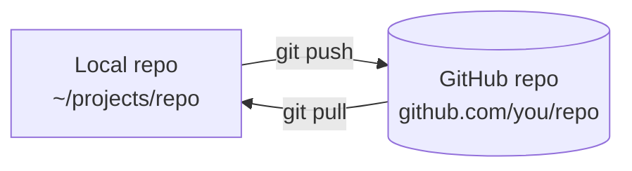
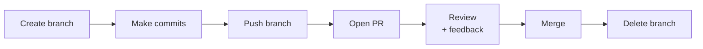

# Day 4 — GitHub workflow

> [!IMPORTANT]
> **Why this matters.** Git lives on your laptop. GitHub puts it on the internet — where collaborators, future employers, and your future self can find it. Your GitHub profile *is* your résumé in this industry. Today you start writing it. By the end of this course it'll be a 35-week wall of green commits, eight projects, eight phase-demo videos. That artifact, that visible record of consistent work — that's the prize behind the laptop.
>
> 🇹🇭 *Git อยู่บนเครื่องเธอ — GitHub เอามันขึ้นอินเทอร์เน็ตให้คนอื่นเห็น คนที่จ้างเธอในอนาคต เพื่อนร่วมงาน และตัวเธอเองในวันข้างหน้าจะหาเธอเจอที่นี่ GitHub profile **คือ** เรซูเม่ในวงการนี้ วันนี้เริ่มเขียนมัน — 35 สัปดาห์ข้างหน้าจะเป็นกำแพง commit สีเขียว 8 โปรเจกต์ 8 วิดีโอ ไอ้สิ่งที่เห็นได้นั่นแหละคือรางวัลที่แท้จริง ไม่ใช่แค่ MacBook*

## What you'll do today

**Time:** 2–3 hours.

By the end:

- [ ] Your `learning-log` repo lives at `github.com/yourname/learning-log` — public
- [ ] You've made commits via the browser and via the CLI
- [ ] You've opened a pull request, addressed feedback, and merged it
- [ ] You've caused — and resolved — a merge conflict between local and remote
- [ ] You understand `.gitignore` and what should never be committed

## The mental model

There are two copies of every repo: the one on your laptop, and the one on GitHub.



`push` sends your commits up. `pull` brings their commits down. That's the whole synchronization.

> [!NOTE]
> **In the wild:** GitHub hosts over 400 million repos. Every major open-source project — React, Linux, VS Code, Python, TensorFlow — lives there. When you open a pull request today, you're using the exact same UI used by engineers at Meta, Microsoft, and Anthropic to ship code worth billions.

## 1. Create the `learning-log` repo on GitHub

Go to [github.com/new](https://github.com/new).

| Field | Value |
|-------|-------|
| Repository name | `learning-log` |
| Description | "My 9-month learning log for Project Prince" |
| Visibility | **Public** |
| Initialize with README | **No** (we'll do it locally) |
| Add .gitignore | **No** |
| Add license | **No** |

Click **Create repository**.

GitHub shows you a "next steps" page. Don't follow it — we're going to do it ourselves so you understand each step.

## 2. Connect your local repo to GitHub

```bash
$ cd ~/prince
$ mkdir learning-log
$ cd learning-log
$ git init -b main
Initialized empty Git repository in /Users/you/prince/learning-log/.git/
```

Make a README:

```bash
$ cat > README.md << 'EOF'
# Learning Log

My 35-week journey through Project Prince — from "what's a terminal" to shipping
a real AI-powered web app on my own server.

Started: $(date +%Y-%m-%d)

## Sections
- `log/` — daily entries
- `goals.md` — what I want from this
- `typing-progress.md` — wpm tracker
EOF

$ git add README.md
$ git commit -m "Initial commit"
```

> [!TIP]
> `cat > file << 'EOF' ... EOF` is called a **heredoc**. It lets you write multi-line text without escaping quotes. You'll use this a lot.

Now connect to GitHub. **Use the SSH URL, not HTTPS:**

```bash
$ git remote add origin git@github.com:YOUR_USERNAME/learning-log.git
$ git branch -M main
$ git push -u origin main
Enumerating objects: 3, done.
...
To github.com:yourname/learning-log.git
 * [new branch]      main -> main
branch 'main' set up to track 'origin/main'.
```

Open `https://github.com/YOUR_USERNAME/learning-log` in a browser. **You should see your README.**

This is the first time your work is on the public internet. Take a screenshot. You'll want it later.

## 3. The push/pull cycle

### Local change → push

```bash
$ echo "Day 4 of 245" >> README.md
$ git add README.md
$ git commit -m "Track day count"
$ git push
```

Refresh GitHub in your browser. Your change is there.

### Browser change → pull

Now do the reverse. On GitHub:

1. Click on `README.md`
2. Click the pencil (edit) icon
3. Change anything (add a line, fix a typo)
4. Scroll down → write commit message → click **Commit changes**

Back in your terminal:

```bash
$ git pull
remote: Enumerating objects: 5, done.
...
Fast-forward
 README.md | 1 +
 1 file changed, 1 insertion(+)
```

The browser-side change is now on your laptop.

> [!WARNING]
> **Always `git pull` before you start working.** Skipping this is the #1 cause of merge conflicts. If you and the browser version both changed the same line, you're in for some fun.

## 4. The pull request workflow

Direct pushes to `main` are fine for solo throwaway repos. For real work — and for the rest of this course — you'll use **pull requests** (PRs).



Let's run that loop.

```bash
$ git switch -c add-goals
Switched to a new branch 'add-goals'

$ cat > goals.md << 'EOF'
# Goals for Project Prince

## What I want to learn
1. Actually build software that real people use.
2. Stop being intimidated by terminals and servers.
3. Get good enough at programming that I could pay rent with it someday.

## What I'm worried about
- I'll get stuck on something stupid and not ask for help.
- I'll burn out around month 4.
- I'll cheat with AI even though the rules say not to.
EOF

$ git add goals.md
$ git commit -m "Add learning goals doc"
$ git push -u origin add-goals
```

GitHub will print a URL in the push output — something like:

```
remote: Create a pull request for 'add-goals' on GitHub by visiting:
remote:      https://github.com/yourname/learning-log/pull/new/add-goals
```

Open that URL.

In the PR form:

| Field | Value |
|-------|-------|
| Title | "Add learning goals doc" |
| Description | "Outlines what I want to learn and what I'm worried about. Will revisit at end of Phase 3." |

Click **Create pull request**.

You've made your first PR. The mentor reviews it. After approval:
1. Click **Merge pull request** → **Confirm merge**.
2. Optionally click **Delete branch** (the branch is no longer needed).

Back in your terminal:

```bash
$ git switch main
$ git pull
$ git branch -d add-goals    # delete local branch too
```

## 5. The `.gitignore` file

Some files should **never** be committed:

- `.env` — secrets, API keys
- `node_modules/`, `__pycache__/`, `.venv/` — generated, huge, recreatable
- `.DS_Store`, `Thumbs.db` — OS junk
- IDE configs (mostly)

Make a `.gitignore`:

```bash
$ cat > .gitignore << 'EOF'
# OS
.DS_Store
Thumbs.db

# Logs / temp
*.log
*.tmp

# Secrets
.env
.env.local
.env.*.local

# Dependencies
node_modules/
__pycache__/
.venv/
venv/

# Build outputs
dist/
build/

# Editor
.idea/
.vscode/*
!.vscode/extensions.json
EOF

$ git add .gitignore
$ git commit -m "Add .gitignore"
$ git push
```

> [!WARNING]
> **If a secret has already been committed**, it's permanently in git history — even if you delete the file in a later commit. Anyone with access to the repo can find it. Removing leaked secrets from history is hard and the secret should be **rotated** (changed at the source) immediately. Lesson: never commit a `.env` file. Ever.

## 6. Anatomy of a good commit message

The convention every senior engineer uses:

```
Short summary (50 chars or less, imperative mood)

Optional longer description. Wrap at 72 chars. Explain WHY,
not WHAT — the diff shows what.

- Bullet points OK
- Reference issues if relevant: #42
```

✅ **Good messages:**
- `Add login page`
- `Fix off-by-one in pagination`
- `Refactor user service to use new auth flow`

❌ **Bad messages:**
- `added stuff` — what stuff?
- `fix` — fix what?
- `WIP` — fine for a draft, never for merged
- `Updated user.py to handle case where user is null because we got errors in the logs that said NoneType has no attribute name and it was super annoying so I added a check` — break it up

**Imperative mood** = "Add this" not "Added this." Think of it as completing the sentence "This commit will **___**."

## Mini-project — the full workflow loop

Do this exact sequence:

```bash
# 1. Make a branch
$ cd ~/prince/learning-log
$ git switch -c add-typing-progress

# 2. Create a file
$ cat > typing-progress.md << 'EOF'
# Typing Progress

Tracking wpm and accuracy weekly. Target: 60+ wpm by end of Phase 2.

| Date       | Source     | wpm | accuracy |
|------------|------------|-----|----------|
| YYYY-MM-DD | Monkeytype |   ? |        ? |
EOF

# 3. Take your baseline test on monkeytype.com (or your tool of choice)
# Edit the table with the real number.

# 4. Commit
$ git add typing-progress.md
$ git commit -m "Add typing progress baseline"

# 5. Push
$ git push -u origin add-typing-progress

# 6. Open the PR (use the URL from the push output)
# Write a real description.

# 7. (Mentor reviews; addresses any feedback.)

# 8. Merge via the GitHub UI.

# 9. Locally clean up
$ git switch main
$ git pull
$ git branch -d add-typing-progress
```

You just did the workflow you'll repeat hundreds of times.

## Connect to the project

> [!TIP]
> **Connects to the project:** Your `learning-log` repo is the Phase 0 project. Today you turned it into a real GitHub repo with a real PR workflow. Tomorrow you'll set up the daily commit habit. By Phase 7's gate, this repo will have **~245 daily entries**, your GitHub contribution graph will be a wall of green, and a recruiter scrolling past it will pause.
>
> Every repo from here forward — `pomo`, `portfolio`, `questly`, your real product — uses this same workflow. Branch, commit, push, PR, review, merge. **You'll do this loop more times than you brush your teeth.** Master it now.

## Self-check

<details>
<summary>1. What's the difference between git and GitHub?</summary>

Git is the version control software (lives on your laptop). GitHub is a website that hosts git repositories and adds collaboration features (pull requests, issues, reviews, actions). Git is the tool; GitHub is one place to store repos.
</details>

<details>
<summary>2. What does <code>git push -u origin main</code> do?</summary>

Pushes the local `main` branch to the remote called `origin`, AND sets up tracking — so future `git push` / `git pull` (without arguments) know which remote+branch to talk to.
</details>

<details>
<summary>3. Why use a pull request instead of pushing directly to main?</summary>

PRs create a review surface: comments, approvals, CI checks, a paper trail of "why this change." Direct pushes to main skip all of that. Even on solo projects, PRs give the mentor a place to leave inline feedback.
</details>

<details>
<summary>4. You accidentally committed your <code>.env</code> file with an API key. What's the right response?</summary>

(1) Immediately rotate (regenerate) the API key at its source — assume the original is now public. (2) Add `.env` to `.gitignore`. (3) Remove the file from the commit (and optionally from history, though that's hard). The key step is **rotation** — once it's in git, deleting doesn't unmake it.
</details>

<details>
<summary>5. You did <code>git push</code> and got an error: "Updates were rejected because the remote contains work that you do not have." What happened, what do you do?</summary>

Someone (or browser-you) pushed to the remote after your last pull. Run `git pull --rebase`, fix any conflicts, then `git push`. Don't `git push --force` — that would erase the other commits.
</details>

<details>
<summary>6. What's an "imperative mood" commit message? Give an example.</summary>

Phrased like an order to the codebase: "Add", "Fix", "Refactor", "Remove" — not "Added", "Fixed", etc. Think: this commit will **___**. Examples: `Add login page`, `Fix race condition in payment handler`.
</details>

## What's next

Tomorrow: habits. The least technical lesson in the course, and the one that decides whether you finish.
