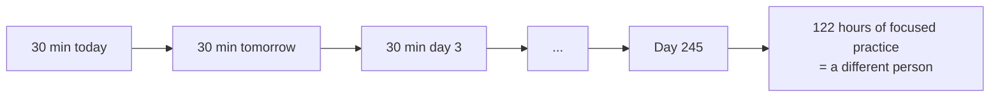
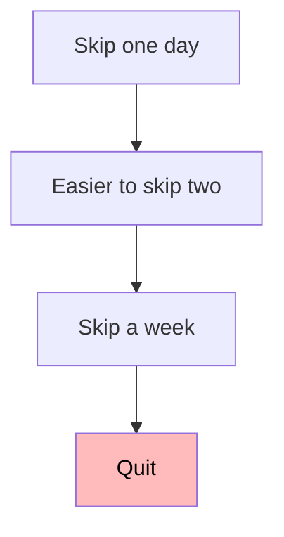

# Day 5 — Habits & typing

> [!IMPORTANT]
> **Why this matters.** Some kids who started this course with shaky math have shipped real apps. Others with perfect grades quit at month 4. The variable isn't IQ. It isn't talent. It's whether they kept showing up on the Tuesday in February when nobody was watching. Today you build the system that gets you to that Tuesday.
>
> 🇹🇭 *เด็กบางคนที่เริ่มเรียนคอร์สนี้โดยเรียนคณิตศาสตร์ไม่เก่ง กลับสร้างแอปจริงสำเร็จ บางคนเกรด 4.00 แต่เลิกตอนเดือนที่ 4 ตัวแปรไม่ใช่ IQ ไม่ใช่พรสวรรค์ ตัวแปรคือ "จะนั่งเปิด laptop ทำต่อมั้ย ในวันอังคารเดือนกุมภาที่ไม่มีใครจ้องมอง" วันนี้สร้างระบบที่จะพาคุณไปถึงวันอังคารนั้น*

## What you'll do today

**Time:** 2 hours today; 30+ minutes a day for the rest of the course.

By the end:

- [ ] You have a daily routine you can sustain for 35 weeks
- [ ] You've taken your typing baseline test and recorded the number
- [ ] You've blocked daily work time on a real calendar
- [ ] You've written `goals.md` — what you actually want from this
- [ ] You understand the AI policy and why it exists
- [ ] You've read this whole lesson twice

That last one matters. The technical lessons you'll re-read when you forget syntax. This one is the only lesson you'll fail by ignoring.

## The compound effect



30 minutes a day for 35 weeks = **122 hours of focused practice**. That's a college course. A serious one. It's enough to take a beginner to "actually useful." The math doesn't lie. What lies is *people* — to themselves — about whether they're actually doing the 30 minutes.

> [!NOTE]
> **In the wild:** John Carmack, who built Doom and Quake, kept a daily commit streak for years. Every working engineer you'd want to be has the boring discipline part figured out. The fun part — building the cool stuff — is downstream of that discipline.

## The daily routine

Every working day looks like this:

| Block | Duration | What |
|-------|----------|------|
| **Warm-up** | 10 min | Typing practice (Monkeytype etc.) |
| **Review** | 5 min | Re-read yesterday's log. Set today's one main goal. |
| **Deep work** | 60–180 min | The thing you said you'd do. No phone. No social media. |
| **Log entry** | 10 min | Today's `log/YYYY-MM-DD.md` — three bullets. |
| **Commit** | 2 min | At least one commit pushed. Even if it's just the log entry. |

**Minimum viable day:** warm-up + 30 min deep work + log + commit.

There will be days you can't do more. There will be days you don't want to. The minimum keeps the chain alive.

## Typing — the unglamorous superpower

You'll be at the keyboard ~1000 hours over the next 35 weeks. If you type 30 wpm, that's twice as long as someone who types 60. **And worse: hunt-and-peck typing makes you avoid trying things, because typing is friction.**

### Targets

| End of phase | wpm target | Why |
|--------------|-----------|-----|
| Phase 0 | record baseline | Know where you start |
| Phase 2 | 60 wpm | Programming feels fluid |
| Phase 4 | 75 wpm | You think *with* the keyboard, not despite it |
| Phase 7 | 80+ wpm | You out-type most senior engineers |

### How to actually get there

1. **Touch type.** No looking at the keyboard. Yes, even for `;` `'` `{` `}`.
2. **Accuracy > speed.** Aim for 97%+. Speed comes from low error rate, not from going faster.
3. **Look ahead.** Don't watch the character you're typing. Watch 5 characters ahead.
4. **10 minutes a day, every day, for a year.** That's the entire trick.

### Pick a tool — one only

- [**Monkeytype**](https://monkeytype.com/) — clean, customizable. Most popular.
- [**keybr.com**](https://www.keybr.com/) — targets your weak letters first.
- [**typing.club**](https://www.typing.club/) — structured curriculum.

> [!TIP]
> **Why not "just type a lot"?** Untargeted typing reinforces bad habits. These tools give immediate feedback and target your specific weak spots. 10 min on Monkeytype > 60 min of unfocused typing.

### Track it

Open the `typing-progress.md` file you made yesterday. Take your baseline test now. Record:

```markdown
| Date       | Source     | wpm | accuracy |
|------------|------------|-----|----------|
| 2026-05-21 | Monkeytype |  38 |     94%  |
```

Take a screenshot. Commit. Push.

Update once a week. The number trending up is a tangible signal that your hands are getting smarter.

## The learning log

The single most important habit. Every day, in `learning-log/log/YYYY-MM-DD.md`:

```markdown
# 2026-05-21

## What I worked on
-

## What I learned
-

## What I'm stuck on / next
-
```

### Rules — these matter

1. **Same-day, not backfilled.** Sunday-night marathons of "what did I do this week" defeat the purpose. The mentor can tell. Trust me.
2. **Specifics, not vibes.** "Learned how `git rebase --interactive` works and finally understood why we don't merge feature branches into main" beats "learned more about git."
3. **Be honest about getting stuck.** "Spent 3 hours on a CORS error before realizing the API was off" is gold. The mentor will not judge. The mentor will absolutely judge "Made great progress" with no details.
4. **Re-read last week's logs every Sunday.** Patterns emerge. You'll notice topics you keep avoiding. Confront those.

### What good looks like

```markdown
# 2026-06-15

## What I worked on
- Finished the Phase 1 quiz. Got 22/25.
- Started the `pomo` CLI project — got `start`, `stop`, `list` working.
- Wrote 12 tests, all passing.

## What I learned
- `argparse` subparsers — much cleaner than long if/elif chains.
- That my mental model of `commit()` vs `flush()` was wrong; flush stages
  the SQL but doesn't end the transaction. Commit ends it.
- Pomodoro myself works much better than I expected; I did 4 cycles today.

## What I'm stuck on / next
- The `--since today` parser is weird with timezones. Tomorrow I'll
  switch to `datetime.now(UTC)` and convert to local at display time.
- Need to remember to write a README before the gate.
```

### What bad looks like

```markdown
# 2026-06-15

## What I worked on
- Phase 1 stuff

## What I learned
- A lot

## What I'm stuck on / next
- Keep going
```

If your log looks like the bad one for more than 2 days in a row, the mentor will notice and the next Friday call will be about that.

## The commit habit

**One commit per day. Minimum. No exceptions.**

It doesn't have to be code. It can be:
- Today's learning log entry
- A typo fix in your README
- A note about something you want to remember tomorrow



The streak is the structure. The visible green graph on GitHub:

```
─■─■─■─■─■─■─■─■─■─■─■─■─■─■─■─■─■─■─■─■─■─■─■─■─■─■─
                                                       ↑
                                              the day you quit
```

After 35 weeks, your contribution graph is **the best résumé entry you'll have for years.** It says "this person shows up, every day, for 9 months, no one made them, they just did it." That signal is worth more to a recruiter than a CS degree.

## Distraction protocol

Programming requires sustained attention. You will not develop sustained attention if you check your phone every 5 minutes.

During deep-work blocks, non-negotiable:

1. **Phone in another room.** Not face-down. Not Do Not Disturb. Another room.
2. **No social media tabs open.** Close them BEFORE you start.
3. **One thing at a time.** Stuck on a Python problem? Don't "take a quick break" to do typing practice. Push through, or take a real break (walk outside, no phone).
4. **A timer running.** Pomodoro (25/5) works. Or a 60-minute block. Just give it a start and an end.

> [!WARNING]
> **If you can't do 25 uninterrupted minutes without checking your phone**, your first month will be miserable. This isn't a moral judgment; it's a training problem. The attention muscle atrophied. Build it back, starting today, with 25 minutes.

## The weekly rhythm

Pick one model. Stick with it.

**Six days on, Sunday off.** (Recommended.)
- Pro: prevents burnout. Sunday for re-reading logs and planning.
- Con: rest day breaks momentum if you don't have rituals.

**Every day, light on weekends.**
- Pro: never breaks the streak.
- Con: easier to over-extend and burn out.

For most teen learners, **six on, Sunday off**. Sunday is for:
- Re-reading the week's logs
- Planning next week
- No coding

The mentor Friday call is the social anchor of the week. The Sunday review is the personal one.

## The AI policy

You read this on Day 1. Re-read it now: [resources/ai-policy.md](../../resources/ai-policy.md).

The TL;DR:

| Phase | AI coding assistant | AI for explanations |
|-------|---------------------|---------------------|
| 0–2 | ❌ Off | ❌ Off |
| 3–5 | ❌ Off | ✅ After you've tried |
| 6 | ⚠️ Limited | ✅ Yes |
| 7 | ✅ Yes | ✅ Yes |

**The mentor will check.** Friday calls include "walk me through this file in your own words." If you used AI and can't explain, the PR doesn't merge. Doesn't matter how nice the code looks.

> [!NOTE]
> The point isn't that AI is bad. The point is **judgment**. You can't tell when AI is wrong until you've been right yourself many times. Phase 7 unlocks AI because by then you can tell. Phase 0 doesn't because you can't.

## Mini-exercise — your week, scheduled

Now, before this lesson is done:

### 1. Set up the file structure

```bash
$ cd ~/prince/learning-log
$ mkdir -p log
$ cat > log/2026-05-21.md << 'EOF'
# 2026-05-21

## What I worked on
- Day 5 of Phase 0. Habits lesson.

## What I learned
- The compound math: 30 min/day × 245 days = 122 hours.
- Why the AI policy is what it is — judgment is the prize.
- My typing baseline is __ wpm at __% accuracy.

## What I'm stuck on / next
- Tomorrow: take the Phase 0 quiz and prep for the gate.
EOF

$ git add log/
$ git commit -m "Day 5 log entry"
$ git push
```

(Use today's actual date, not the placeholder.)

### 2. Open a real calendar app

Block the following recurring events for the next 4 weeks:

- **Monday–Saturday**, [your time slot] — Project Prince (2–3 hours)
- **Friday** [time TBD with mentor] — Mentor check-in (30 min)
- **Sunday morning** — Week review (30 min, no coding)

Treat these like meetings. If you'd reschedule a meeting for a conflict, reschedule the block too. **If you wouldn't reschedule the meeting, don't reschedule the block.**

### 3. Write your real `goals.md`

The version you wrote yesterday was a draft. Now you've seen more of what's ahead. Write the real one.

```bash
$ cd ~/prince/learning-log
$ git switch -c update-goals
```

Edit `goals.md`. Cover:

1. **What do you want from this?** Not "the laptop." That gets you started; it doesn't get you to month 6. What does?
2. **3 specific things you want to be able to build.**
3. **1 thing you're scared of.** Be honest. The mentor reads this.
4. **What you'll do if you want to quit at month 4.** Spoiler: you will at some point. Write the answer now while you're motivated.

Commit. Open a PR. The mentor will read it carefully.

## Connect to the project

> [!TIP]
> **Connects to the project:** This lesson IS the project, indefinitely. The repo you set up yesterday lives or dies based on the habit you're forming today. The "did the work" / "didn't do the work" question is settled here, not in the technical phases. Get this right and the rest is just learning. Get this wrong and no curriculum saves you.

## Self-check

<details>
<summary>1. What's the minimum viable day on this course?</summary>

10 min typing warm-up + 30 min deep work + 10 min log entry + 1 commit pushed. ~50 minutes. Anything less doesn't count.
</details>

<details>
<summary>2. Why commit on days when you didn't really do any code?</summary>

To preserve the streak. The habit is the structure; the volume is secondary. Skipping one day makes the next easier to skip. A commit on a "nothing" day is a vote against quitting.
</details>

<details>
<summary>3. What's the AI policy in Phase 0–2 and why?</summary>

No AI coding tools, no AI explanations. The point is to develop the judgment to know when AI is wrong, and that judgment only forms by doing it yourself first. Phase 7 unlocks AI.
</details>

<details>
<summary>4. You took your typing baseline. The number was disappointing. What do you do?</summary>

Record it honestly. Don't retry until you get a better number — that's lying to yourself. 10 min/day of practice will move it. The starting number doesn't matter; the trend does.
</details>

<details>
<summary>5. Why is "Sunday off" recommended for the weekly rhythm?</summary>

Because 35 weeks is long. Sustainable beats heroic. Sunday becomes the day for re-reading the week's logs and planning, which is itself valuable — without coding burnout.
</details>

<details>
<summary>6. What does your future GitHub contribution graph signal to a recruiter, after 35 weeks?</summary>

That you show up. Consistently. Without supervision. For 9 months. That signal is worth more than most credentials at this career stage.
</details>

## What's next

Tomorrow you start **Phase 1: Python & CLI Foundations.** The technical phase. Show up at the time you blocked. The system is built. Now you use it.
