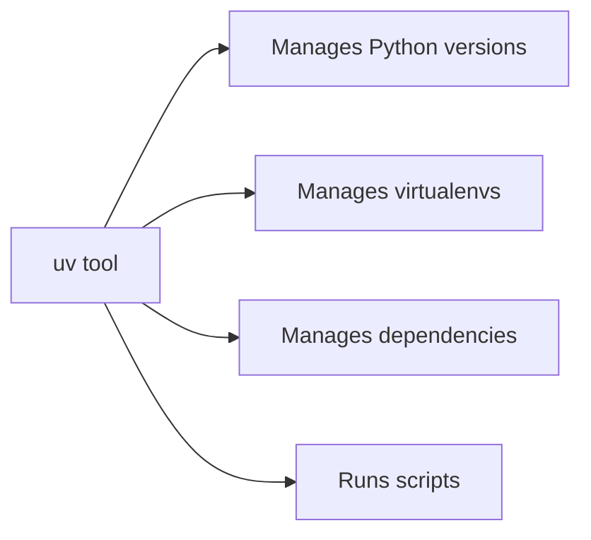

# Day 0 — Set up your Python environment

> [!IMPORTANT]
> **Why this matters.** A messy Python install is the single most common reason beginners quit Python in week 1. Wrong version, wrong virtualenv, packages installed globally, weird `pip` errors. Today you set up `uv` — the modern, fast, opinionated tool that makes Python feel as smooth as Node — and never have any of these problems.

## What you'll do today

**Time:** 1 hour.

By the end:

- [ ] `uv` installed and on your PATH
- [ ] Python 3.13 installed via `uv`
- [ ] A first project created with `uv init`
- [ ] You've run your first `python` script with `uv run`
- [ ] You've added a dev dependency (`ruff`, `mypy`) and seen them work
- [ ] You understand virtualenvs without ever typing `python -m venv`

## The mental model



`uv` is a Python project manager. It replaces:

| Old way (don't use) | New way (use this) |
|---------------------|--------------------|
| `pyenv install 3.13` | `uv python install 3.13` |
| `python -m venv .venv` | (automatic) |
| `source .venv/bin/activate` | `uv run python` |
| `pip install requests` | `uv add requests` |
| `pip install -r requirements.txt` | `uv sync` |
| `pip freeze > requirements.txt` | (automatic via `uv.lock`) |

Five tools collapsed into one.

> [!NOTE]
> **In the wild:** `uv` is written by Astral, the team behind `ruff` (the linter you'll use). It's 10–100× faster than `pip`. Polars, FastAPI, and a growing list of major projects have switched to it. You're learning the modern stack, not the legacy stack.

## 1. Install `uv`

**macOS / Linux / WSL:**

```bash
$ curl -LsSf https://astral.sh/uv/install.sh | sh
```

The script prints what it's about to do — read it before pressing Enter on anything that asks.

Restart your shell:

```bash
$ exec $SHELL
$ uv --version
uv 0.5.4 (or similar)
```

If `uv: command not found`: the install script told you it needed to add `~/.local/bin` to your PATH and you may need to restart your terminal entirely (close and reopen).

## 2. Install Python via `uv`

```bash
$ uv python install 3.13
Searching for Python versions matching: Python 3.13
Installed Python 3.13.0 in 8s

$ uv python list
cpython-3.13.0-macos-aarch64-none      /Users/you/.local/share/uv/python/cpython-3.13.0/bin/python3
cpython-3.13.0+freethreaded-...        (not installed)
...
```

You can have multiple Python versions side by side. `uv` picks the right one per project.

## 3. Your first `uv` project

```bash
$ cd ~/prince
$ mkdir -p scratch && cd scratch
$ uv init python-warmup
Initialized project `python-warmup` at `/Users/you/prince/scratch/python-warmup`

$ cd python-warmup
$ ls -la
.gitignore
.python-version
README.md
main.py
pyproject.toml
```

What `uv init` made:

| File | What it is |
|------|------------|
| `pyproject.toml` | Project config — name, version, dependencies. The new standard. |
| `.python-version` | Pins Python version for this project. |
| `main.py` | Sample script. |
| `README.md` | Empty for now. |
| `.gitignore` | Includes `.venv/` (you should never commit it). |

Look at `pyproject.toml`:

```bash
$ cat pyproject.toml
[project]
name = "python-warmup"
version = "0.1.0"
description = "Add your description here"
readme = "README.md"
requires-python = ">=3.13"
dependencies = []
```

That's the **single source of truth** for the project. No more `requirements.txt`, `setup.py`, `setup.cfg`, `Pipfile`. Just this one file.

## 4. Run something

```bash
$ uv run python main.py
Hello from python-warmup!
```

`uv run` does three things invisibly:
1. Resolves the project's dependencies.
2. Creates a `.venv/` if it doesn't exist.
3. Runs the command inside that venv.

No `source .venv/bin/activate`. No `python -m venv`. Just `uv run`.

> [!TIP]
> If you check `which python` after `uv run`, you'll see the path is inside `.venv/`. The venv is real, you just didn't have to create it manually.

## 5. Add some dependencies

```bash
$ uv add --dev ruff mypy
Resolved 4 packages in 200ms
Downloaded 2 packages in 1.2s
Installed 4 packages in 100ms
 + mypy==1.13.0
 + mypy-extensions==1.0.0
 + ruff==0.7.4
 + typing-extensions==4.12.2
```

`--dev` = development dependency. Won't be installed when someone deploys your code; only when they're developing it.

Look at `pyproject.toml` now:

```toml
[project]
name = "python-warmup"
# ...
dependencies = []

[dependency-groups]
dev = [
    "mypy>=1.13.0",
    "ruff>=0.7.4",
]
```

And there's a new file: `uv.lock`. **That file is the exact version of every dependency, every sub-dependency, every hash.** Reproducible installs. Commit it.

## 6. Verify the tools work

```bash
$ uv run ruff check main.py
All checks passed!

$ uv run ruff format main.py
1 file already formatted

$ uv run mypy main.py
Success: no issues found in 1 source file
```

`ruff` is your linter and formatter. `mypy` is your type checker. From now on, before any commit, run all three.

## 7. The everyday loop

```bash
# Edit main.py in VS Code
$ code .

# Make changes...

# Check it
$ uv run ruff format .         # auto-format
$ uv run ruff check .          # lint
$ uv run mypy .                # type-check
$ uv run python main.py        # run it

# All good? Commit it.
$ git add .
$ git commit -m "Add hello function"
```

Set up a shell alias if you want:

```bash
$ echo 'alias check="uv run ruff format . && uv run ruff check . && uv run mypy ."' >> ~/.zshrc
$ exec $SHELL
$ check                         # one command, all three checks
```

## Mini-exercise — your first Python project

You'll throw this project away after today. The goal is to get the **muscle memory** of the loop.

```bash
$ cd ~/prince/scratch/python-warmup

# Edit main.py to something more interesting:
$ cat > main.py << 'EOF'
def main() -> None:
    name = input("What's your name? ")
    age_str = input("How old are you? ")
    age = int(age_str)
    next_year = age + 1
    print(f"Hi {name}! Next year you'll be {next_year}.")

if __name__ == "__main__":
    main()
EOF

# Check it
$ uv run ruff check .
All checks passed!

$ uv run mypy .
Success: no issues found in 1 source file

# Run it
$ uv run python main.py
What's your name? Prince
How old are you? 16
Hi Prince! Next year you'll be 17.
```

**Now break it on purpose.**

Edit `main.py` and change `age = int(age_str)` to `age = age_str + 1`. Save. Run mypy:

```bash
$ uv run mypy .
main.py:4: error: Unsupported operand types for + ("str" and "int")  [operator]
Found 1 error in 1 file (checked 1 source file)
```

mypy caught the bug **before** you ran the program. That's the value of type hints. Fix it. Re-run.

> [!TIP]
> **Type checkers are bug-finders.** They catch a whole class of errors that would have shown up at runtime. Use them. `mypy --strict` is the goal — every variable typed, no implicit Anys.

## Connect to the project

> [!TIP]
> **Connects to the project:** Your Phase 1 project (`pomo`) starts with **exactly this setup** — `uv init`, `uv add` dependencies, `pyproject.toml`. Master the workflow today on this throwaway. When you start `pomo` next week, the tooling fades into the background and you focus on the actual problem.

## Self-check

<details>
<summary>1. What's <code>uv</code> replacing? Name three older tools.</summary>

`pyenv` (Python version management), `python -m venv` (virtualenv creation), `pip` (package installs), `pip-tools` / `Pipfile.lock` (lockfile generation), `pip freeze` (dependency export). Any of these.
</details>

<details>
<summary>2. Why don't you need to <code>source .venv/bin/activate</code> with uv?</summary>

`uv run` automatically uses the project's venv. The venv still exists; you just don't have to activate it manually for each shell session.
</details>

<details>
<summary>3. What's the difference between <code>uv add requests</code> and <code>uv add --dev pytest</code>?</summary>

`uv add` adds a runtime dependency (used in production). `uv add --dev` adds a dev-only dependency (linter, test framework, etc.) — installed when developing but not necessarily when deployed.
</details>

<details>
<summary>4. Should you commit <code>uv.lock</code> to git? <code>.venv/</code>?</summary>

**Yes** for `uv.lock` (reproducible installs across machines). **No, never** for `.venv/` (huge, machine-specific, regenerated by `uv sync`).
</details>

<details>
<summary>5. mypy and ruff — what does each do?</summary>

`ruff` is a linter (catches code style/quality issues) AND formatter (reformats code consistently). `mypy` is a type checker — verifies your type hints are correct and consistent.
</details>

## What's next

Tomorrow: **open your first Jupyter notebook and write Python.** Variables, types, the REPL — the building blocks.
