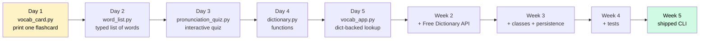

# Phase 1 Running Project — `english-helper`

A real tool you build piece by piece across all 25 lessons of Phase 1. By the end you have a CLI you actually use to learn English — flashcards, IPA pronunciation, audio, daily quizzes, real definitions from a real dictionary API.

> [!IMPORTANT]
> **Why this is real.** You're a Thai high school student in Canada. English vocabulary and pronunciation are real problems for you. Most courses give you toy projects ("build a calculator"). This course gives you a tool that solves a problem you actually have. By the time you finish Phase 1, you'll have studied with something you built yourself — that's a feeling no textbook can give.

## The arc

Each day adds ONE capability. The tool is always usable; it just gets better.



## What each piece does

### Week 1 — Pure Python, no libraries

**Day 1 — `vocab_card.py`**
Print a single, formatted flashcard. Uses: variables, f-strings, string multiplication.

```
================================
  ENGLISH: ubiquitous
   THAI:   พบเห็นได้ทั่วไป
   POS:    adjective
================================
"Smartphones have become ubiquitous in modern life."
================================
```

**Day 2 — `word_list.py`**
A typed list of vocabulary words with IPA pronunciation. Uses: type hints, dict, list, for loops.

```
$ uv run python word_list.py
ubiquitous     /juːˈbɪkwɪtəs/        พบเห็นได้ทั่วไป
thorough       /ˈθʌrə/                ละเอียด
inevitable     /ɪˈnevɪtəbl/           ที่ไม่อาจหลีกเลี่ยงได้
nuance         /ˈnuːɑːns/             ความแตกต่างที่ละเอียดอ่อน
```

**Day 3 — `pronunciation_quiz.py`**
Quiz user on IPA: random word, user types IPA, program checks. Uses: if/elif, for/while, input(), random.

```
$ uv run python pronunciation_quiz.py
Word: thorough
What's the IPA? /thuruh/
Wrong! The correct IPA is /ˈθʌrə/

Word: nuance
What's the IPA? /ˈnuːɑːns/
Correct! 🎯

Score: 1/2
```

**Day 4 — `dictionary.py`**
Refactor everything into functions. Uses: functions, errors, docstrings, type hints in signatures.

```python
def lookup(word: str) -> WordEntry | None: ...
def add_word(entry: WordEntry) -> None: ...
def random_word() -> WordEntry: ...
def quiz_one(entry: WordEntry) -> bool: ...
```

**Day 5 — `vocab_app.py`**
A persistent dict-backed mini-app — save words to a JSON file, load them back. Uses: dicts, sets (no duplicates), JSON files, pathlib.

```
$ uv run python vocab_app.py
> add resilient /rɪˈzɪliənt/ ยืดหยุ่นสามารถฟื้นตัวได้
Added.
> lookup resilient
resilient   /rɪˈzɪliənt/   ยืดหยุ่นสามารถฟื้นตัวได้
> quiz
[runs 5-word quiz]
> stats
You know 23 words. Best streak: 8.
> exit
```

### Week 2 — Talking to the real internet

**Day 6 — Introducing `requests`**
Install the `requests` library. Make your first HTTP call to the [Free Dictionary API](https://dictionaryapi.dev/). No key needed.

```python
import requests

response = requests.get("https://api.dictionaryapi.dev/api/v2/entries/en/thorough")
data = response.json()
# {phonetics: [{text: "/ˈθʌrə/", audio: "https://..."}, ...], meanings: [...]}
```

**Day 7–10** — Build the dictionary lookup feature:
- Parse the API response.
- Handle "word not found" (404).
- Cache results locally so you don't re-hit the API.
- Add audio URL retrieval (you can `open` it in a browser).

End of Week 2:

```
$ uv run english_helper.py lookup epiphany
epiphany   /ɪˈpɪfəni/  🔊 https://api.dictionaryapi.dev/media/pronunciations/...
   noun.   A moment of sudden, intuitive understanding.
   "She had an epiphany about her career direction."
```

### Week 3 — Classes, files, structure

**Days 11–15:**
- Move from loose dicts to a `Word` dataclass.
- Refactor the JSON-file storage into a `WordStore` class.
- Add spaced-repetition logic (`SRSScheduler` class).
- Save your real study history to disk.

### Week 4 — Tests

**Days 16–20:**
- Add `pytest`. Test every function and class.
- Test the API caller with a recorded fixture (no real network calls in tests).
- Hit 80%+ coverage.

### Week 5 — Ship it

**Days 21–25:**
- Polish the CLI with `argparse`.
- Package as a proper Python project.
- Install with `uv tool install` so `english-helper` works globally from your terminal.
- Ship the final version of `pomo` (Phase 1 capstone) at the same time — they share the same skills.

## How this connects to the rest of the course

| What you build | When | Why |
|---|---|---|
| `english-helper` | Phase 1 — daily mini-projects | Real tool you actually use; muscle memory for `pomo` |
| `pomo` | Phase 1 — end-of-phase capstone | Bigger, tested, packaged — same skills, harder spec |
| `english-helper-api` | Phase 3 (idea) | Move it to FastAPI; multi-user; share with classmates |
| `english-helper-web` | Phase 4 (idea) | Next.js frontend; sync with the API |
| Phase 6 product | Phase 6 | If it's been useful to your friends, this *is* your Phase 6 product. Done. |
| Phase 7 AI features | Phase 7 | Add "explain this word with AI", "generate example sentences", "score my pronunciation" — your capstone writes itself |

By the time you reach Phase 7, **your capstone might be a version of english-helper with AI features.** Many learners spend Phase 6/7 inventing a product idea. You'll have one ready, with users who already trust it.

## Where the files live

```
~/prince/scratch/english-helper/
├── README.md
├── pyproject.toml          # added Day 0 (setup)
├── vocab_card.py           # Day 1
├── word_list.py            # Day 2
├── pronunciation_quiz.py   # Day 3
├── dictionary.py           # Day 4
├── vocab_app.py            # Day 5
├── english_helper.py       # Week 2+ (replaces above)
├── words.json              # generated — your saved vocabulary
└── tests/                  # Week 4+
```

> [!TIP]
> **Use it daily.** Add 5 new English words a week from your school readings. Use the pronunciation quiz before bed. By Phase 5 you'll have 100+ words you actually know — and a tool you built to learn them.

## A note on the words

Pick **real words you don't know yet**, not easy ones. The point isn't to look smart; it's to learn vocabulary. When you hit a word in a textbook you don't know — that's a candidate. Add it. Look up the IPA. Add the Thai. Quiz yourself in 3 days.

## When you're stuck

- The Free Dictionary API docs: https://dictionaryapi.dev/
- IPA chart: https://www.ipachart.com/ (clickable, audible)
- Your mentor on Friday calls
- Phase 1 lessons themselves — go back, re-read

This project is YOUR project. The mentor will help you, but you decide what words to study, what features to add, how to use it. Make it yours.
